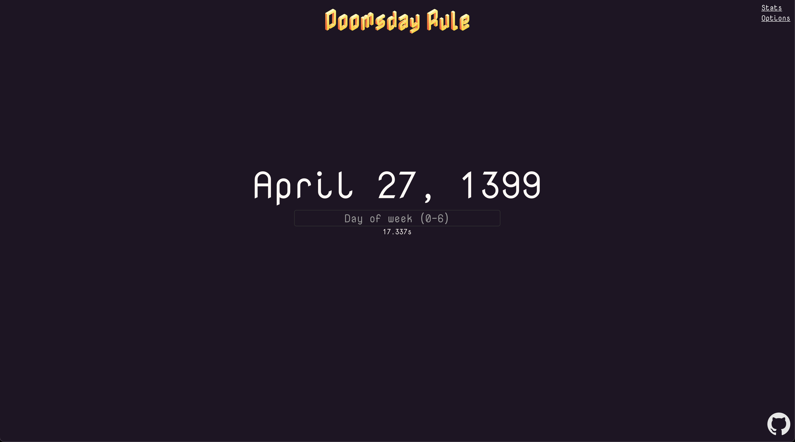
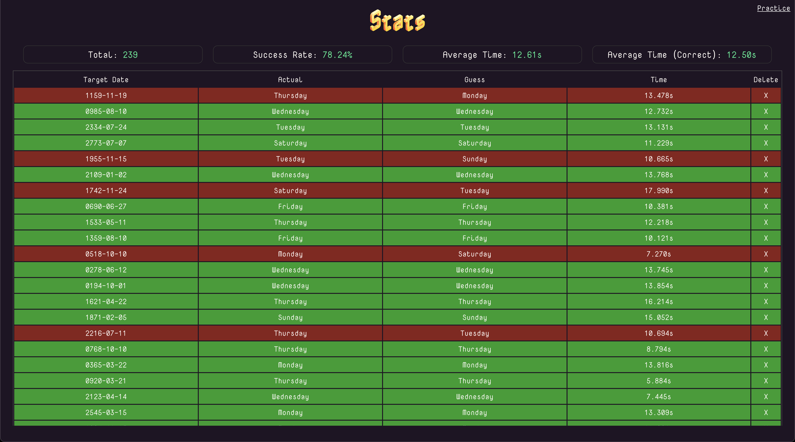

# Doomsday Rule Practice

Web app to practice [doomsday rule](https://en.wikipedia.org/wiki/Doomsday_rule), tracks stats, etc..

## Options

### Blind Mode (0-10s)

How long until date disappears from screen (0s means no blind mode)

### Input Mode

- **TextInput**, typing 0-6 on keyboard, r for reload.
- **ButtonInput**, press the weekday buttons
- **TextButtonInput**, typing or pressing the buttons

### Date Display Mode

- **YYYYMMDD**, ex. 1423-04-23
- **DDMMYYYY**, ex. 23-04-1423
- **MMDDYYYY**, ex. 04-23-1423
- **MonthDDYYYY**, ex. April 23, 1423

### Date Range

- **StartYear-01-01 to EndYear-12-31**
